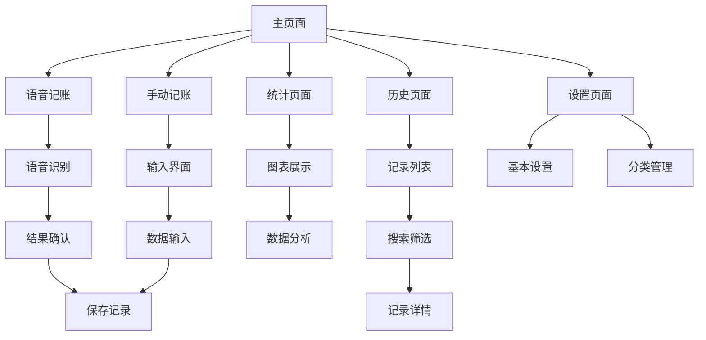

# AI语音记账产品需求文档

## 1. 产品概览

AI语音记账是一款基于iOS平台的智能记账应用，通过语音识别技术让用户能够快速、便捷地记录日常支出。应用支持语音输入和手动输入两种记账方式，并提供丰富的统计分析功能。

产品主要解决传统记账应用输入繁琐、操作复杂的痛点，让记账变得更加自然和高效。目标用户为有记账需求的iOS用户，特别是希望简化记账流程的年轻用户群体。

## 2. 核心功能

### 2.1 用户角色

本应用为单用户应用，无需区分用户角色，所有功能对用户开放。

### 2.2 功能模块

应用包含以下核心页面：

1. **记账页面**: 语音记账按钮、手动记账按钮、本月支出概览、今日记录列表
2. **统计页面**: 支出趋势图表、分类分布饼图、时间段选择器、详细统计数据
3. **历史页面**: 支出记录列表、搜索功能、分类筛选、记录编辑和删除
4. **设置页面**: 货币单位设置、记账提醒设置、主题模式、分类管理
5. **语音输入页面**: 语音识别界面、实时文字显示、识别结果确认
6. **手动输入页面**: 金额输入、分类选择、备注输入、自定义数字键盘

### 2.3 页面详情

| 页面名称 | 模块名称 | 功能描述 |
|---------|---------|----------|
| 记账页面 | 本月支出卡片 | 显示当月总支出金额、同比增长率、货币符号适配 |
| 记账页面 | 语音记账按钮 | 启动语音识别、录音状态指示、语音转文字处理 |
| 记账页面 | 手动记账按钮 | 打开手动输入界面、快速记账入口 |
| 记账页面 | 今日记录 | 显示当日所有支出记录、快速查看和编辑 |
| 统计页面 | 时间选择器 | 支持月度、季度、年度统计切换 |
| 统计页面 | 趋势图表 | 使用Charts框架显示支出趋势、支持交互式查看 |
| 统计页面 | 分类分布 | 饼图显示各分类支出占比、颜色编码区分 |
| 统计页面 | 统计概览 | 总支出、日均支出、记录笔数等关键指标 |
| 历史页面 | 搜索功能 | 支持按备注和分类名称搜索记录 |
| 历史页面 | 分类筛选 | 水平滚动的分类标签、支持多选筛选 |
| 历史页面 | 记录列表 | 按日期分组显示、支持滑动编辑和删除 |
| 历史页面 | 记录详情 | 显示完整记录信息、支持编辑修改 |
| 设置页面 | 基本设置 | 货币单位选择、记账提醒开关、主题模式切换 |
| 设置页面 | 分类管理 | 查看所有分类、添加自定义分类、编辑分类属性 |
| 设置页面 | 关于信息 | 应用版本、开发者信息、用户反馈入口 |
| 语音输入页面 | 录音控制 | 大型麦克风按钮、录音状态动画、音频波形显示 |
| 语音输入页面 | 文字识别 | 实时显示识别文字、识别准确度指示 |
| 语音输入页面 | 结果解析 | 自动提取金额、分类、备注信息 |
| 语音输入页面 | 确认界面 | 显示解析结果、支持修改和确认保存 |
| 手动输入页面 | 金额输入 | 自定义数字键盘、小数点支持、金额格式化 |
| 手动输入页面 | 分类选择 | 网格布局显示所有分类、图标和颜色区分 |
| 手动输入页面 | 备注输入 | 文本输入框、常用备注快捷选择 |
| 手动输入页面 | 保存操作 | 数据验证、保存确认、错误提示 |

## 3. 核心流程

### 3.1 语音记账流程
用户点击语音记账按钮 → 请求麦克风权限 → 开始录音识别 → 显示识别文字 → 停止录音 → 解析支出信息 → 显示识别结果 → 用户确认 → 保存记录 → 返回主页

### 3.2 手动记账流程
用户点击手动记账按钮 → 打开输入页面 → 输入金额 → 选择分类 → 输入备注 → 点击保存 → 数据验证 → 保存成功 → 返回主页

### 3.3 数据查看流程
用户进入统计页面 → 选择时间段 → 查看图表数据 → 切换统计维度 → 查看详细分类 → 进入历史页面 → 搜索筛选记录 → 查看记录详情

## 4. 用户界面设计

### 4.1 设计风格

- **主色调**: 深色主题 (#1C1C1E)，辅助色蓝色 (#007AFF)
- **按钮样式**: 圆角矩形设计，支持按压反馈动画
- **字体**: 系统默认字体，标题使用粗体，正文使用常规字重
- **布局风格**: 卡片式设计，顶部导航栏，底部标签栏导航
- **图标风格**: 使用 SF Symbols 系统图标，保持一致性

### 4.2 页面设计概览

| 页面名称 | 模块名称 | UI元素 |
|---------|---------|--------|
| 记账页面 | 本月支出卡片 | 深色背景卡片、白色文字、绿色增长指示器、32pt大号金额字体 |
| 记账页面 | 语音记账按钮 | 红色渐变背景、白色麦克风图标、80pt高度、圆角12pt |
| 记账页面 | 手动记账按钮 | 蓝色背景、白色加号图标、与语音按钮等宽 |
| 统计页面 | 趋势图表 | Charts框架实现、蓝色线条、渐变填充、交互式缩放 |
| 统计页面 | 分类饼图 | 多彩色块、分类图标、百分比标签、点击高亮 |
| 历史页面 | 搜索栏 | 圆角输入框、灰色背景、放大镜图标、清除按钮 |
| 历史页面 | 分类标签 | 水平滚动、圆角标签、分类颜色、选中状态 |
| 语音输入页面 | 麦克风按钮 | 120pt圆形按钮、红色录音状态、脉冲动画效果 |
| 语音输入页面 | 波形动画 | 5个矩形条、红色填充、随机高度动画 |
| 设置页面 | 设置项 | 左侧图标、标题文字、右侧值显示、箭头指示器 |

### 4.3 响应式设计

应用采用iOS原生响应式设计，自动适配不同尺寸的iPhone设备。支持竖屏和横屏显示，针对大屏设备优化布局。所有交互元素支持触摸操作，按钮具有合适的点击区域大小。

## 5. 技术特性

### 5.1 语音识别能力
- 支持中文普通话识别
- 实时语音转文字
- 智能解析金额和分类信息
- 噪音环境适应性

### 5.2 数据管理
- 本地数据存储，保护用户隐私
- SwiftData框架提供高性能数据操作
- 支持数据备份和恢复
- 自动数据同步和更新

### 5.3 用户体验
- 流畅的动画效果
- 直观的操作反馈
- 智能的输入建议
- 个性化的设置选项

## 6. 性能要求

### 6.1 响应时间
- 应用启动时间 < 2秒
- 页面切换响应 < 0.5秒
- 语音识别延迟 < 1秒
- 数据保存操作 < 0.3秒

### 6.2 资源占用
- 内存占用 < 100MB
- 存储空间 < 50MB
- CPU使用率 < 30%
- 电池消耗优化

## 7. 兼容性要求

- **系统要求**: iOS 16.0及以上版本
- **设备支持**: iPhone 8及以上机型
- **语言支持**: 简体中文
- **网络要求**: 无需网络连接，完全离线使用

## 8. 安全和隐私

### 8.1 数据安全
- 所有数据本地存储，不上传云端
- 支持设备锁屏密码保护
- 数据加密存储

### 8.2 权限管理
- 麦克风权限：用于语音记账功能
- 语音识别权限：用于语音转文字
- 通知权限：用于记账提醒功能

## 9. 未来扩展规划

### 9.1 功能扩展
- 预算管理和预警
- 收入记录功能
- 数据导出和分享
- 多账户管理

### 9.2 平台扩展
- macOS版本开发
- Apple Watch配套应用
- iCloud数据同步

### 9.3 智能化升级
- AI智能分类推荐
- 消费习惯分析
- 个性化记账建议
- 语音识别准确率提升