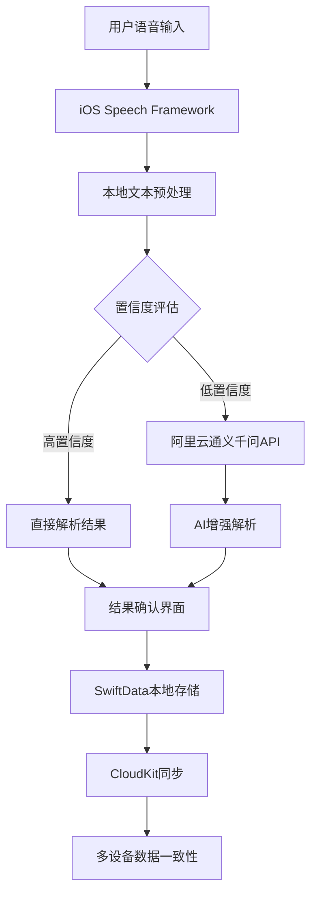
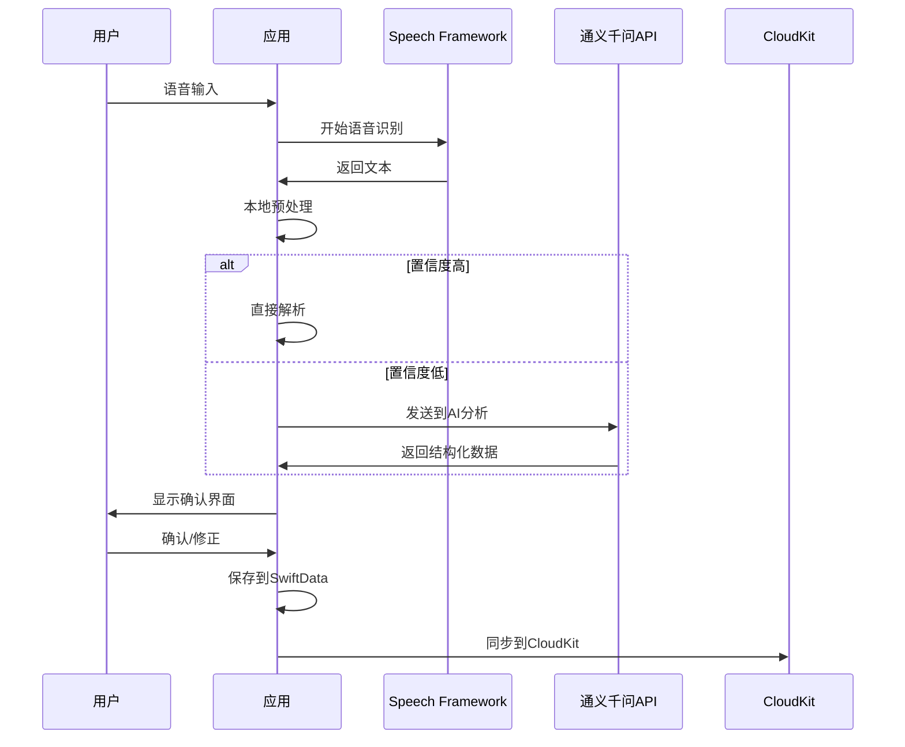

# AI语音记账应用详细开发计划

## 1. 项目概述和目标

### 1.1 项目现状
- ✅ 完整的前端UI界面（SwiftUI实现）
- ✅ 本地数据存储（SwiftData）
- ✅ 基础语音识别功能
- ❌ 缺少云端数据同步
- ❌ 语音识别准确率有待提升
- ❌ 缺少智能分析功能

### 1.2 项目目标
- **核心目标**：将语音识别准确率从60%提升到90%+
- **数据同步**：实现跨设备数据自动同步
- **用户体验**：减少手动修正，提升记账效率
- **成本控制**：零服务器维护成本
- **扩展性**：为未来功能扩展奠定基础

### 1.3 成功指标
- 语音识别准确率达到90%以上
- 用户手动修正率降低70%
- 数据同步成功率99%以上
- 应用启动时间<2秒
- 语音处理响应时间<3秒

## 2. 技术架构设计

### 2.1 整体架构



### 2.2 核心技术栈
- **前端**：SwiftUI + iOS 17+
- **本地存储**：SwiftData
- **云端同步**：CloudKit
- **语音识别**：Speech Framework
- **AI增强**：阿里云通义千问API
- **网络请求**：URLSession + async/await
- **安全存储**：Keychain Services

### 2.3 数据流设计



## 3. 详细开发计划

### 阶段一：数据服务优化（第1-2周）

#### 3.1 CloudKit集成
**目标**：实现数据云端同步功能

**具体任务**：
1. **CloudKit配置**（2天）
   - 在Apple Developer后台启用CloudKit
   - 配置Container和Database Schema
   - 设置Record Types（ExpenseRecord, Category等）
   
2. **数据模型适配**（2天）
   ```swift
   // 为SwiftData模型添加CloudKit支持
   @Model
   class ExpenseRecord {
       @Attribute(.unique) var id: UUID
       var amount: Double
       var category: String
       var note: String
       var date: Date
       var isCloudSynced: Bool = false
   }
   ```

3. **同步服务实现**（3天）
   ```swift
   class CloudSyncService {
       func enableCloudSync() async throws
       func syncToCloud(_ record: ExpenseRecord) async throws
       func fetchFromCloud() async throws -> [ExpenseRecord]
       func resolveConflicts() async throws
   }
   ```

4. **离线支持**（2天）
   - 实现离线队列机制
   - 网络恢复时自动同步
   - 冲突解决策略

5. **测试验证**（1天）
   - 多设备同步测试
   - 网络异常处理测试

#### 3.2 现有功能优化
**目标**：提升基础语音识别准确率

**具体任务**：
1. **正则表达式优化**（1天）
   ```swift
   // 支持更多中文数字格式
   let chineseNumberPattern = "(一|二|三|四|五|六|七|八|九|十|百|千|万)+"
   let mixedNumberPattern = "\\d+[.]?\\d*|" + chineseNumberPattern
   ```

2. **关键词库扩展**（1天）
   - 增加更多消费类别关键词
   - 支持同义词识别
   - 添加常用商家名称

3. **错误处理增强**（1天）
   - 添加详细的错误日志
   - 用户友好的错误提示
   - 自动重试机制

**里程碑**：CloudKit同步功能完成，基础识别准确率提升至70%

### 阶段二：AI功能集成（第3-5周）

#### 3.3 阿里云通义千问API集成
**目标**：实现AI增强的语音文本解析

**具体任务**：
1. **API服务封装**（3天）
   ```swift
   class TongYiQianWenService {
       private let apiKey: String
       private let baseURL = "https://dashscope.aliyuncs.com/api/v1/services/aigc/text-generation/generation"
       
       func analyzeExpenseText(_ text: String) async throws -> ExpenseAnalysisResult {
           let prompt = buildPrompt(for: text)
           let response = try await sendRequest(prompt: prompt)
           return try parseResponse(response)
       }
       
       private func sendRequest(prompt: String) async throws -> Data {
           var request = URLRequest(url: URL(string: baseURL)!)
           request.httpMethod = "POST"
           request.setValue("Bearer \(apiKey)", forHTTPHeaderField: "Authorization")
           request.setValue("application/json", forHTTPHeaderField: "Content-Type")
           
           let requestBody = [
               "model": "qwen-turbo",
               "input": [
                   "messages": [
                       ["role": "user", "content": prompt]
                   ]
               ],
               "parameters": [
                   "result_format": "message"
               ]
           ]
           
           request.httpBody = try JSONSerialization.data(withJSONObject: requestBody)
           
           let (data, _) = try await URLSession.shared.data(for: request)
           return data
       }
   }
   ```

2. **智能提示词设计**（2天）
   ```swift
   private func buildPrompt(for text: String) -> String {
       return """
       你是一个专业的记账助手，请分析以下语音转文本的记账信息，准确提取关键信息。
       
       语音文本："\(text)"
       
       请严格按照以下JSON格式返回，不要添加任何其他内容：
       {
         "amount": 金额数字(必须是数字类型),
         "category": "分类名称",
         "note": "备注信息",
         "confidence": 置信度(0.0-1.0之间的小数),
         "suggestions": ["可能的修正建议1", "建议2"]
       }
       
       分类规则：
       - 餐饮：吃饭、喝咖啡、外卖、聚餐等
       - 交通：打车、地铁、公交、加油、停车等
       - 购物：买衣服、日用品、电子产品等
       - 娱乐：电影、游戏、KTV、旅游等
       - 医疗：看病、买药、体检等
       - 教育：培训、书籍、课程等
       - 住房：房租、水电费、物业费等
       - 其他：无法明确分类的支出
       
       注意：
       1. 金额必须提取准确的数字
       2. 如果文本中有"元"、"块"、"毛"等单位，请正确转换
       3. 置信度基于文本清晰度和信息完整性评估
       """
   }
   ```

3. **混合解析策略**（3天）
   ```swift
   class HybridParsingService {
       private let localParser = LocalExpenseParser()
       private let aiService = TongYiQianWenService()
       
       func parseExpenseText(_ text: String) async -> ParseResult {
           // 1. 本地快速解析
           let localResult = localParser.parse(text)
           
           // 2. 置信度评估
           if localResult.confidence > 0.8 {
               return localResult
           }
           
           // 3. AI增强解析
           do {
               let aiResult = try await aiService.analyzeExpenseText(text)
               return combineResults(local: localResult, ai: aiResult)
           } catch {
               // AI服务失败时降级到本地解析
               return localResult
           }
       }
       
       private func combineResults(local: ParseResult, ai: ExpenseAnalysisResult) -> ParseResult {
           // 优先使用AI结果，但保留本地解析作为备选
           return ParseResult(
               amount: ai.amount ?? local.amount,
               category: ai.category.isEmpty ? local.category : ai.category,
               note: ai.note.isEmpty ? local.note : ai.note,
               confidence: max(local.confidence, ai.confidence)
           )
       }
   }
   ```

4. **缓存和优化**（2天）
   - 实现结果缓存机制
   - API调用频率限制
   - 成本控制策略

5. **安全性实现**（2天）
   ```swift
   class SecurityManager {
       // 使用Keychain安全存储阿里云API密钥
       func storeAPIKey(_ key: String) {
           let keychain = Keychain(service: "com.aivc.tongyi")
           keychain["api_key"] = key
       }
       
       func getAPIKey() -> String? {
           let keychain = Keychain(service: "com.aivc.tongyi")
           return keychain["api_key"]
       }
   }
   ```
   - 阿里云API密钥安全存储（Keychain）
   - HTTPS数据传输加密
   - 本地数据隐私保护
   - API调用日志脱敏处理

#### 3.4 智能分析功能
**目标**：提供消费模式分析和建议

**具体任务**：
1. **消费模式分析**（3天）
   ```swift
   class ExpenseAnalyzer {
       func analyzeSpendingPatterns() -> SpendingInsights {
           // 分析消费趋势、类别分布、异常支出等
       }
   }
   ```

2. **智能分类建议**（2天）
   - 基于历史数据的分类推荐
   - 学习用户习惯

**里程碑**：AI解析功能完成，整体识别准确率达到85%

### 阶段三：用户体验优化（第6-7周）

#### 3.5 交互体验优化
**目标**：提升用户操作体验和准确率

**具体任务**：
1. **结果确认界面**（3天）
   ```swift
   struct ConfirmationView: View {
       @State private var result: ParseResult
       
       var body: some View {
           VStack {
               // 显示解析结果
               // 置信度指示器
               // 快速修正按钮
               // 一键确认功能
           }
       }
   }
   ```

2. **智能修正建议**（2天）
   - 基于上下文的修正建议
   - 常见错误的快速修正

3. **语音反馈优化**（2天）
   - 实时语音识别状态
   - 音频质量检测
   - 环境噪音处理

4. **快捷操作**（2天）
   - 手势操作支持
   - 快捷键设置
   - 批量操作功能

**里程碑**：用户体验显著提升，手动修正率降低60%

### 阶段四：功能扩展（第8-10周）

#### 3.6 高级功能实现
**目标**：增加智能化功能，提升产品竞争力

**具体任务**：
1. **预算管理**（4天）
   ```swift
   class BudgetManager {
       func setBudget(category: String, amount: Double, period: BudgetPeriod)
       func checkBudgetStatus() -> [BudgetAlert]
       func generateBudgetReport() -> BudgetReport
   }
   ```

2. **消费提醒**（3天）
   - 预算超支提醒
   - 异常消费检测
   - 定期消费报告

3. **数据导出**（2天）
   - Excel/CSV导出
   - 图表生成
   - 分享功能

4. **多平台适配**（5天）
   - iPad界面优化
   - Apple Watch支持
   - macOS版本规划

**里程碑**：完整功能集成，准确率达到90%+

## 4. 风险评估和应对策略

### 4.1 技术风险

| 风险项 | 概率 | 影响 | 应对策略 |
|--------|------|------|----------|
| 阿里云通义千问API稳定性 | 中 | 高 | 实现降级机制，本地解析兜底 |
| CloudKit同步冲突 | 中 | 中 | 完善冲突解决策略，用户手动选择 |
| 语音识别准确率不达标 | 低 | 高 | 多轮测试优化，用户反馈迭代 |
| iOS系统兼容性 | 低 | 中 | 充分测试，向下兼容策略 |

### 4.2 业务风险

| 风险项 | 概率 | 影响 | 应对策略 |
|--------|------|------|----------|
| API成本超预算 | 中 | 中 | 实现成本监控，设置调用上限 |
| 用户隐私担忧 | 低 | 高 | 透明的隐私政策，本地优先处理 |
| 竞品功能超越 | 中 | 中 | 持续功能迭代，差异化定位 |

### 4.3 应对措施
1. **技术降级方案**：确保在外部服务不可用时，应用仍能基本运行
2. **成本控制**：设置API调用限制，实现智能缓存
3. **用户教育**：提供使用指南，提升语音输入质量
4. **持续监控**：实现错误日志和性能监控

## 5. 测试计划

### 5.1 单元测试（贯穿开发过程）
- **覆盖率目标**：80%以上
- **重点模块**：
  - 语音识别解析逻辑
  - CloudKit同步服务
  - 阿里云通义千问API集成
  - 数据模型转换

### 5.2 集成测试（每阶段结束）
- **CloudKit同步测试**：
  - 多设备数据一致性
  - 网络异常恢复
  - 大量数据同步性能

- **AI解析测试**：
  - 各种语音输入场景
  - API响应时间和准确率
  - 降级机制验证

### 5.3 用户验收测试（第9-10周）
- **内部测试**：团队成员日常使用测试
- **Beta测试**：邀请10-20名用户参与测试
- **性能测试**：压力测试和边界条件测试

### 5.4 测试用例设计

```swift
// 语音识别测试用例示例
class SpeechRecognitionTests: XCTestCase {
    func testBasicExpenseParsing() {
        let input = "今天午餐花了25块钱"
        let result = parser.parse(input)
        XCTAssertEqual(result.amount, 25.0)
        XCTAssertEqual(result.category, "餐饮")
    }
    
    func testComplexExpenseParsing() {
        let input = "在星巴克买咖啡三十八块五"
        let result = parser.parse(input)
        XCTAssertEqual(result.amount, 38.5)
        XCTAssertEqual(result.note, "星巴克咖啡")
    }
}
```

## 6. 部署和发布计划

### 6.1 开发环境配置
- **Xcode版本**：15.0+
- **iOS目标版本**：17.0+
- **依赖管理**：Swift Package Manager
- **CI/CD**：Xcode Cloud

### 6.2 发布策略

#### 6.2.1 内测版本（第8周）
- **目标**：内部团队测试
- **功能范围**：核心功能完整
- **分发方式**：TestFlight内部测试

#### 6.2.2 Beta版本（第9周）
- **目标**：外部用户测试
- **功能范围**：所有计划功能
- **分发方式**：TestFlight公开测试
- **用户规模**：100人以内

#### 6.2.3 正式版本（第10周）
- **目标**：App Store发布
- **功能范围**：经过充分测试的稳定版本
- **营销策略**：
  - App Store优化（ASO）
  - 社交媒体推广
  - 用户评价收集

### 6.3 发布检查清单

- [ ] 所有功能测试通过
- [ ] 性能指标达标
- [ ] 隐私政策完善
- [ ] App Store截图和描述准备
- [ ] 客服支持准备
- [ ] 用户反馈收集机制
- [ ] 紧急修复流程

## 7. 项目管理和协作

### 7.1 开发工具
- **代码管理**：Git + GitHub
- **项目管理**：GitHub Projects
- **文档协作**：Notion/Confluence
- **设计协作**：Figma

### 7.2 工作流程
- **每日站会**：同步进度和问题
- **周度回顾**：评估里程碑完成情况
- **代码审查**：确保代码质量
- **持续集成**：自动化测试和构建

### 7.3 质量保证
- **代码规范**：SwiftLint配置
- **架构审查**：重要模块设计评审
- **性能监控**：关键指标持续跟踪
- **用户反馈**：快速响应和迭代

## 8. 成本预算

### 8.1 开发成本
- **人力成本**：10周 × 1人 = 2.5个月开发时间
- **Apple Developer费用**：$99/年
- **测试设备**：已有iOS设备

### 8.2 运营成本
- **CloudKit**：免费（1GB存储 + 10GB传输）
- **阿里云通义千问API**：预估¥300-600/月（基于使用量）
- **App Store费用**：30%分成（收费应用）

### 8.3 成本控制策略
- 实现API调用缓存，减少重复请求
- 设置每用户每日调用限制
- 监控成本使用情况，及时调整策略

## 9. 后续迭代规划

### 9.1 短期优化（3个月内）
- 基于用户反馈优化识别准确率
- 增加更多消费类别和场景
- 性能优化和bug修复

### 9.2 中期扩展（6个月内）
- 多人账本功能
- 银行卡数据导入
- 高级统计分析

### 9.3 长期愿景（1年内）
- AI财务顾问功能
- 投资记录管理
- 企业版本开发

---

**项目成功的关键因素**：
1. 严格按照开发计划执行
2. 持续的用户测试和反馈收集
3. 技术风险的提前识别和应对
4. 成本的有效控制和监控
5. 高质量的代码和充分的测试覆盖

通过这个详细的开发计划，我们有信心在10周内完成一个高质量、用户体验优秀的AI语音记账应用，并为后续的功能扩展奠定坚实的基础。