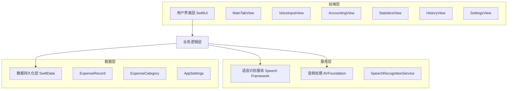
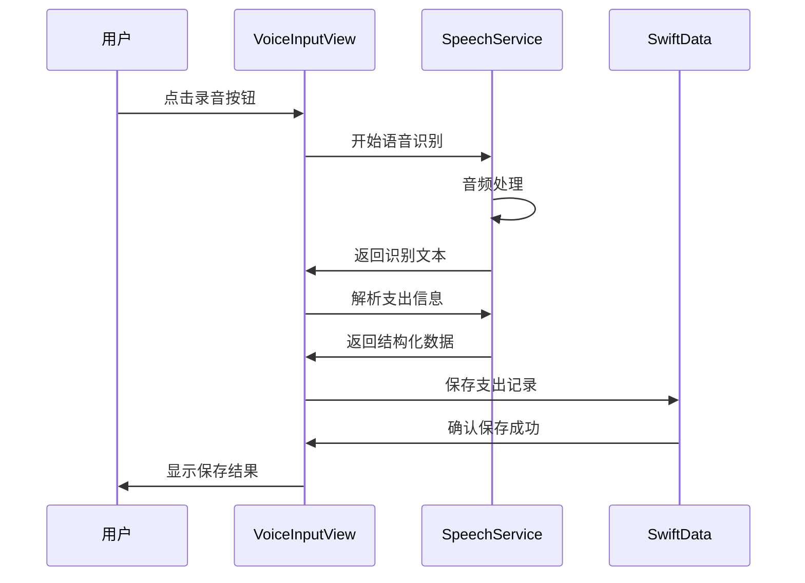

# AI语音记账项目技术架构分析

## 1. 架构设计



## 2. 技术描述

- **前端框架**: SwiftUI + iOS 16.3+
- **数据持久化**: SwiftData (Core Data的现代化替代)
- **语音识别**: Speech Framework
- **音频处理**: AVFoundation
- **图表组件**: Charts Framework
- **开发工具**: Xcode 16.3
- **最低支持版本**: iOS 16.0+

## 3. 核心模块分析

### 3.1 数据模型层

#### ExpenseRecord (支出记录)
```swift
@Model
class ExpenseRecord {
    var id: UUID
    var amount: Double
    var note: String
    var timestamp: Date
    var isVoiceInput: Bool
    var category: ExpenseCategory?
}
```

#### ExpenseCategory (支出分类)
```swift
@Model
class ExpenseCategory {
    var id: UUID
    var name: String
    var iconName: String
    var colorHex: String
    var isDefault: Bool
}
```

#### AppSettings (应用设置)
```swift
@Model
class AppSettings {
    var id: UUID
    var currency: String
    var reminderEnabled: Bool
    var reminderTime: Date
    var themeMode: String
}
```

### 3.2 语音识别服务

**核心功能**:
- 实时语音转文字
- 智能解析金额、分类和备注
- 权限管理和错误处理
- 音频会话管理

**技术实现**:
- 使用 `SFSpeechRecognizer` 进行语音识别
- 支持中文语音识别 (zh-CN)
- 实时音频缓冲处理
- 正则表达式解析语音内容

### 3.3 用户界面层

**主要视图组件**:
- `MainTabView`: 主标签导航
- `VoiceInputView`: 语音输入界面
- `AccountingView`: 记账主页
- `StatisticsView`: 统计分析页面
- `HistoryView`: 历史记录页面
- `SettingsView`: 设置页面

## 4. 数据流架构



## 5. 性能优化分析

### 5.1 当前优化点
- 使用 SwiftData 的懒加载查询
- 图表数据按需计算
- 语音识别实时处理优化

### 5.2 潜在优化建议
1. **内存优化**
   - 实现分页加载历史记录
   - 优化大量数据的查询性能
   - 添加图片缓存机制

2. **语音识别优化**
   - 添加离线语音识别支持
   - 优化语音解析算法准确率
   - 实现语音识别结果缓存

3. **用户体验优化**
   - 添加骨架屏加载效果
   - 优化动画性能
   - 实现更智能的分类推荐

## 6. 代码质量评估

### 6.1 优点
- 使用现代化的 SwiftUI 和 SwiftData
- 良好的 MVVM 架构模式
- 代码结构清晰，模块化程度高
- 遵循 Swift 编码规范

### 6.2 改进建议
1. **错误处理**
   - 统一错误处理机制
   - 添加更详细的错误日志
   - 实现网络错误重试机制

2. **测试覆盖**
   - 增加单元测试覆盖率
   - 添加 UI 自动化测试
   - 实现语音识别功能测试

3. **代码复用**
   - 提取公共组件
   - 统一样式管理
   - 优化重复代码

## 7. 架构合理性审查

### 7.1 架构优势
- **现代化技术栈**: 使用最新的 iOS 开发技术
- **数据驱动**: SwiftData 提供强大的数据管理能力
- **响应式设计**: SwiftUI 的声明式编程模式
- **模块化设计**: 清晰的分层架构

### 7.2 架构风险
- **iOS 版本依赖**: 最低支持 iOS 16.0+
- **单平台限制**: 仅支持 iOS 平台
- **语音识别依赖**: 依赖系统语音识别服务

## 8. 可扩展性分析

### 8.1 水平扩展能力
- 易于添加新的记账分类
- 支持多币种扩展
- 可扩展统计维度

### 8.2 垂直扩展建议
1. **功能扩展**
   - 添加预算管理功能
   - 实现数据导出功能
   - 支持多账户管理

2. **平台扩展**
   - 开发 macOS 版本
   - 实现 iCloud 同步
   - 添加 Apple Watch 支持

3. **集成扩展**
   - 银行卡交易导入
   - 第三方支付平台集成
   - AI 智能分析功能

## 9. 安全性分析

### 9.1 数据安全
- 本地数据存储，无网络传输风险
- SwiftData 提供数据加密支持
- 用户隐私数据不上传云端

### 9.2 权限管理
- 麦克风权限请求和管理
- 语音识别权限控制
- 本地通知权限管理

## 10. 依赖关系分析

### 10.1 系统依赖
- iOS 16.0+ 系统要求
- Speech Framework
- AVFoundation
- SwiftUI
- SwiftData
- Charts

### 10.2 第三方依赖
- 无外部第三方库依赖
- 完全基于 Apple 官方框架

## 11. 部署和维护建议

### 11.1 部署策略
- App Store 发布
- TestFlight 内测
- 企业内部分发

### 11.2 维护建议
- 定期更新 iOS 系统适配
- 监控语音识别准确率
- 收集用户反馈优化体验
- 定期备份和数据迁移测试